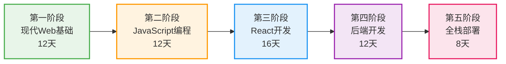

# 🚀 60天现代Web开发课程

> 从零基础到全栈工程师的完整学习路径

  <h2>🎯 课程目标</h2>
  
通过60天系统化的学习，掌握现代Web开发的核心技术栈，成为一名合格的全栈开发工程师。

## 👋 欢迎来到现代Web开发之旅！

欢迎加入这个精心设计的60天学习计划！无论你是编程新手还是想要更新技能的开发者，这个课程都将帮助你掌握当今最流行和实用的Web开发技术。

### 🌟 为什么选择这个课程？

  

    <h4>📅 结构化学习</h4>
    
60天循序渐进的学习计划，每天都有明确的学习目标和实践项目

  

  

    <h4>🛠️ 实战导向</h4>
    
通过5个完整项目，将理论知识转化为实际开发能力

  

  

    <h4>🔥 最新技术</h4>
    
涵盖2024年最新的Web开发技术栈和最佳实践

  

  

    <h4>💡 深度理解</h4>
    
不仅教你"怎么做"，更重要的是理解"为什么"

  

## 📚 课程概览

### 学习路径图

### 🎓 你将学到什么？

  

    <h4>🌐 第一阶段：现代Web基础（Day 1-12）</h4>
    <ul>
      <li>Git版本控制与协作开发</li>
      <li>HTML5语义化与可访问性</li>
      <li>CSS3高级布局（Flexbox、Grid）</li>
      <li>响应式设计与移动优先</li>
      <li>性能优化基础</li>
    </ul>
  

  
  

    <h4>💻 第二阶段：JavaScript现代编程（Day 13-24）</h4>
    <ul>
      <li>ES6+现代语法特性</li>
      <li>异步编程（Promise、Async/Await）</li>
      <li>函数式编程思想</li>
      <li>面向对象编程</li>
      <li>TypeScript基础</li>
    </ul>
  

  
  

    <h4>⚛️ 第三阶段：React现代开发（Day 25-40）</h4>
    <ul>
      <li>React核心概念与Hooks</li>
      <li>状态管理（Context、Redux）</li>
      <li>路由与导航</li>
      <li>性能优化技巧</li>
      <li>测试驱动开发</li>
    </ul>
  

  
  

    <h4>🚀 第四阶段：后端开发（Day 41-52）</h4>
    <ul>
      <li>Node.js与Express框架</li>
      <li>RESTful API设计</li>
      <li>数据库设计（MongoDB、PostgreSQL）</li>
      <li>认证与授权</li>
      <li>实时通信（WebSocket）</li>
    </ul>
  

  
  

    <h4>🌐 第五阶段：全栈集成与部署（Day 53-60）</h4>
    <ul>
      <li>Docker容器化</li>
      <li>CI/CD自动化部署</li>
      <li>云服务部署（AWS/Vercel）</li>
      <li>监控与日志管理</li>
      <li>全栈项目实战</li>
    </ul>
  

## 🚀 快速开始

### 1️⃣ 准备工作

在开始学习之前，请确保你已经：

- [ ] 安装了代码编辑器（推荐 VS Code）
- [ ] 配置了基础开发环境
- [ ] 准备好学习笔记工具

### 2️⃣ 学习建议

  <h4>💡 高效学习技巧</h4>
  <ul>
    <li><strong>每日坚持：</strong>每天至少投入2-3小时的学习时间</li>
    <li><strong>动手实践：</strong>不要只看不练，代码要亲自敲一遍</li>
    <li><strong>记录笔记：</strong>用自己的话总结每天学到的知识点</li>
    <li><strong>解决问题：</strong>遇到问题先尝试自己解决，培养独立思考能力</li>
    <li><strong>项目驱动：</strong>通过项目实践巩固所学知识</li>
  </ul>

### 3️⃣ 开始你的第一天

准备好了吗？让我们从第一天开始你的Web开发之旅！

  <a href="phase-1-modern-web/day-01/README.md" style="background: linear-gradient(45deg, #42b883, #35495e); color: white; padding: 15px 40px; border-radius: 30px; text-decoration: none; font-weight: bold; display: inline-block; transition: all 0.3s;">
    🎯 开始 Day 01 - Git与版本控制基础
  </a>

## 🎯 实战项目预览

在这60天的学习过程中，你将完成以下5个实战项目：

  

    <h3>1. 个人作品集网站</h3>
    
<strong>技术栈：</strong>HTML5, CSS3, JavaScript

    
<strong>特点：</strong>响应式设计、动画效果、性能优化

    
<strong>完成时间：</strong>Day 11-12

  

  
  

    <h3>2. 任务管理应用</h3>
    
<strong>技术栈：</strong>TypeScript, Webpack, LocalStorage

    
<strong>特点：</strong>拖拽功能、数据持久化、模块化架构

    
<strong>完成时间：</strong>Day 23-24

  

  
  

    <h3>3. 电商前端</h3>
    
<strong>技术栈：</strong>React, Redux, React Router

    
<strong>特点：</strong>商品展示、购物车、用户认证

    
<strong>完成时间：</strong>Day 38-40

  

  
  

    <h3>4. 博客API</h3>
    
<strong>技术栈：</strong>Node.js, Express, MongoDB

    
<strong>特点：</strong>RESTful API、JWT认证、文件上传

    
<strong>完成时间：</strong>Day 51-52

  

  
  

    <h3>5. 社交媒体应用</h3>
    
<strong>技术栈：</strong>MERN全栈、Socket.io、Docker

    
<strong>特点：</strong>实时聊天、动态发布、云端部署

    
<strong>完成时间：</strong>Day 57-59

  

## 📊 学习进度跟踪

想要查看你的学习进度？访问我们的[进度追踪页面](progress-tracker.html)来：

- 查看已完成的课程
- 跟踪项目完成情况
- 评估技能掌握程度
- 获取个性化学习建议

  <h4>⚠️ 重要提醒</h4>
  
这是一个密集的学习计划，需要你的承诺和坚持。但请记住，每个人的学习节奏不同，如果你需要更多时间来掌握某个概念，那完全没问题！重要的是理解和掌握，而不是速度。

## 🎉 准备好开始了吗？

恭喜你迈出了成为全栈Web开发者的第一步！在接下来的60天里，我们将一起探索Web开发的精彩世界。

记住：**最好的学习时机是现在！**

  <a href="phase-1-modern-web/day-01/README.md" style="background: #42b883; color: white; padding: 20px 50px; border-radius: 30px; text-decoration: none; font-weight: bold; display: inline-block; font-size: 1.2em; box-shadow: 0 4px 15px rgba(66, 184, 131, 0.3); transition: all 0.3s;">
    🚀 立即开始学习之旅
  </a>

---

  
让我们一起创造令人惊叹的Web应用！

  
💪 相信自己，你可以的！

