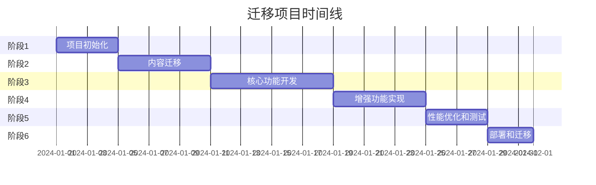

# 60天Web开发课程：Docsify到Astro完整迁移方案

## 项目概述

### 当前状态
- **框架**: Docsify v4 (纯静态文档站点)
- **内容**: 60天课程，5个阶段，每天包含README、练习、解决方案
- **部署**: Vercel
- **特性**: 搜索、代码高亮、分页、响应式设计

### 目标状态
- **框架**: Astro 4.x
- **增强功能**: 进度跟踪、交互式代码编辑器、学习路径可视化
- **性能**: 更快的加载速度、更好的SEO
- **用户体验**: 现代化UI、个性化学习体验

## 一、技术架构设计

### 1.1 Astro项目结构

```
60-day-web-course/
├── src/
│   ├── components/          # 可复用组件
│   │   ├── common/         # 通用组件
│   │   │   ├── Header.astro
│   │   │   ├── Footer.astro
│   │   │   ├── Navigation.astro
│   │   │   └── SearchBar.tsx
│   │   ├── course/         # 课程相关组件
│   │   │   ├── LessonCard.astro
│   │   │   ├── ProgressTracker.tsx
│   │   │   ├── CodeEditor.tsx
│   │   │   ├── ExerciseBlock.astro
│   │   │   └── SolutionViewer.astro
│   │   └── ui/             # UI组件
│   │       ├── Badge.astro
│   │       ├── Button.astro
│   │       └── Card.astro
│   │
│   ├── content/            # 内容集合
│   │   ├── config.ts       # 内容架构定义
│   │   ├── phases/         # 阶段内容
│   │   │   ├── phase-1/
│   │   │   │   └── _meta.json
│   │   │   └── ...
│   │   ├── lessons/        # 课程内容
│   │   │   ├── day-01.mdx
│   │   │   └── ...
│   │   ├── exercises/      # 练习内容
│   │   └── projects/       # 项目内容
│   │
│   ├── layouts/            # 布局模板
│   │   ├── BaseLayout.astro
│   │   ├── CourseLayout.astro
│   │   ├── LessonLayout.astro
│   │   └── ProjectLayout.astro
│   │
│   ├── pages/              # 页面路由
│   │   ├── index.astro     # 首页
│   │   ├── course/
│   │   │   ├── [phase]/
│   │   │   │   └── [day].astro
│   │   │   └── index.astro
│   │   ├── projects/
│   │   │   └── [project].astro
│   │   ├── progress.astro
│   │   └── search.astro
│   │
│   ├── styles/             # 样式文件
│   │   ├── global.css
│   │   ├── themes/
│   │   └── utilities/
│   │
│   ├── lib/                # 工具函数
│   │   ├── content.ts
│   │   ├── progress.ts
│   │   └── search.ts
│   │
│   └── stores/             # 状态管理
│       ├── progress.ts
│       └── preferences.ts
│
├── public/                 # 静态资源
│   ├── assets/
│   ├── code-samples/
│   └── solutions/
│
└── astro.config.mjs       # Astro配置
```

### 1.2 内容管理策略 (Content Collections)

```typescript
// src/content/config.ts
import { z, defineCollection } from 'astro:content';

const phaseSchema = z.object({
  title: z.string(),
  description: z.string(),
  duration: z.string(),
  technologies: z.array(z.string()),
  difficulty: z.enum(['beginner', 'intermediate', 'advanced']),
  order: z.number(),
});

const lessonSchema = z.object({
  title: z.string(),
  description: z.string(),
  phase: z.number(),
  day: z.number(),
  duration: z.string(),
  objectives: z.array(z.string()),
  prerequisites: z.array(z.string()).optional(),
  tags: z.array(z.string()),
  hasExercise: z.boolean(),
  hasSolution: z.boolean(),
  difficulty: z.enum(['easy', 'medium', 'hard']),
});

const exerciseSchema = z.object({
  title: z.string(),
  day: z.number(),
  difficulty: z.enum(['easy', 'medium', 'hard']),
  estimatedTime: z.string(),
  skills: z.array(z.string()),
});

const projectSchema = z.object({
  title: z.string(),
  description: z.string(),
  phase: z.number(),
  days: z.array(z.number()),
  technologies: z.array(z.string()),
  difficulty: z.enum(['beginner', 'intermediate', 'advanced']),
  features: z.array(z.string()),
});

export const collections = {
  phases: defineCollection({ schema: phaseSchema }),
  lessons: defineCollection({ schema: lessonSchema }),
  exercises: defineCollection({ schema: exerciseSchema }),
  projects: defineCollection({ schema: projectSchema }),
};
```

### 1.3 组件架构设计

#### 核心组件

1. **ProgressTracker** (React/Svelte)
   - 显示整体课程进度
   - 每日学习进度
   - 完成的练习和项目
   - 本地存储持久化

2. **CodeEditor** (React + Monaco Editor)
   - 实时代码编辑
   - 语法高亮
   - 多文件支持
   - 运行预览

3. **LessonNavigator**
   - 阶段和天数导航
   - 快速跳转
   - 搜索集成

4. **ExerciseRunner**
   - 练习说明
   - 代码编辑器
   - 测试运行器
   - 解决方案对比

### 1.4 路由设计

```
/                          # 首页
/course                    # 课程总览
/course/phase-1/day-01     # 具体课程页
/projects                  # 项目列表
/projects/portfolio        # 具体项目
/progress                  # 进度追踪
/search                    # 搜索页面
/playground               # 代码练习场
```

### 1.5 样式系统选择

**选择方案: Tailwind CSS + CSS Modules混合**

理由：
- Tailwind提供快速开发和一致性
- CSS Modules用于复杂组件样式
- 支持主题切换（亮/暗模式）
- 响应式设计优先

## 二、功能规划

### 2.1 必须实现的核心功能

1. **内容展示**
   - Markdown/MDX渲染
   - 代码高亮（Shiki）
   - 目录生成
   - 分页导航

2. **搜索功能**
   - 全文搜索（Pagefind）
   - 过滤器（按阶段、标签、难度）
   - 搜索建议

3. **导航系统**
   - 侧边栏导航
   - 面包屑导航
   - 快捷键支持

4. **响应式设计**
   - 移动端优化
   - 平板适配
   - 桌面端体验

### 2.2 增强功能

1. **学习进度追踪**
   - 课程完成状态
   - 学习时长统计
   - 练习完成记录
   - 成就系统

2. **交互式代码编辑器**
   - 在线编辑运行
   - 多文件支持
   - 控制台输出
   - 错误提示

3. **个性化功能**
   - 主题切换
   - 字体大小调整
   - 学习偏好设置
   - 笔记功能

4. **社交功能**
   - 评论系统（Giscus）
   - 分享功能
   - 学习小组

### 2.3 SEO优化策略

1. **技术SEO**
   - 静态站点生成(SSG)
   - 自动sitemap生成
   - robots.txt配置
   - 结构化数据

2. **内容SEO**
   - 元标签优化
   - Open Graph标签
   - Twitter Cards
   - 规范链接

3. **性能优化**
   - 图片懒加载
   - 代码分割
   - 预加载关键资源
   - Service Worker缓存

## 三、迁移步骤

### 阶段1：项目初始化和基础架构 (3-4天)

**任务清单：**
- [ ] 创建Astro项目
- [ ] 配置TypeScript、ESLint、Prettier
- [ ] 设置Tailwind CSS
- [ ] 创建基础布局组件
- [ ] 配置内容集合
- [ ] 设置路由结构
- [ ] 创建通用组件库

**关键代码：**
```bash
# 初始化项目
npm create astro@latest 60-day-web-course -- --template minimal --typescript strict
cd 60-day-web-course
npm install @astrojs/tailwind @astrojs/react @astrojs/mdx
npm install -D @types/node prettier eslint
```

### 阶段2：内容迁移和处理 (5-6天)

**任务清单：**
- [ ] 编写内容迁移脚本
- [ ] 转换Markdown文件为MDX
- [ ] 迁移代码示例
- [ ] 处理图片和静态资源
- [ ] 创建内容元数据
- [ ] 验证内容完整性

**迁移脚本示例：**
```typescript
// scripts/migrate-content.ts
import fs from 'fs-extra';
import path from 'path';
import matter from 'gray-matter';
import glob from 'glob';

async function migrateContent() {
  const sourceDir = '../60-day-modern-course';
  const targetDir = './src/content/lessons';
  
  // 获取所有README.md文件
  const files = glob.sync(`${sourceDir}/phase-*/day-*/README.md`);
  
  for (const file of files) {
    const content = await fs.readFile(file, 'utf-8');
    const { data, content: body } = matter(content);
    
    // 提取元数据
    const pathParts = file.split('/');
    const phase = pathParts[2].replace('phase-', '');
    const day = pathParts[3].replace('day-', '');
    
    // 创建frontmatter
    const frontmatter = {
      title: data.title || `Day ${day}`,
      description: data.description || '',
      phase: parseInt(phase),
      day: parseInt(day),
      ...data
    };
    
    // 生成MDX文件
    const mdxContent = `---
${Object.entries(frontmatter).map(([key, value]) => `${key}: ${JSON.stringify(value)}`).join('\n')}
---

${body}`;
    
    // 写入新文件
    await fs.outputFile(
      path.join(targetDir, `day-${day.padStart(2, '0')}.mdx`),
      mdxContent
    );
  }
}
```

### 阶段3：核心功能开发 (7-8天)

**任务清单：**
- [ ] 实现课程展示页面
- [ ] 开发进度追踪系统
- [ ] 集成搜索功能
- [ ] 创建代码编辑器组件
- [ ] 实现练习系统
- [ ] 开发项目展示页

**核心组件示例：**
```typescript
// src/components/course/ProgressTracker.tsx
import { useState, useEffect } from 'react';
import { useStore } from '@nanostores/react';
import { progressStore } from '@/stores/progress';

export function ProgressTracker() {
  const progress = useStore(progressStore);
  
  const calculateProgress = () => {
    const total = 60;
    const completed = Object.keys(progress.completedLessons).length;
    return (completed / total) * 100;
  };
  
  return (
    <div className="progress-tracker">
      <div className="progress-bar">
        <div 
          className="progress-fill"
          style={{ width: `${calculateProgress()}%` }}
        />
      </div>
      <div className="progress-stats">
        <span>{Object.keys(progress.completedLessons).length} / 60 天完成</span>
        <span>{progress.totalStudyTime} 小时学习时长</span>
      </div>
    </div>
  );
}
```

### 阶段4：增强功能实现 (5-6天)

**任务清单：**
- [ ] 实现主题切换
- [ ] 添加键盘快捷键
- [ ] 集成评论系统
- [ ] 实现笔记功能
- [ ] 添加离线支持
- [ ] 优化移动端体验

### 阶段5：性能优化和测试 (3-4天)

**任务清单：**
- [ ] 性能审计和优化
- [ ] SEO优化
- [ ] 跨浏览器测试
- [ ] 移动端测试
- [ ] 可访问性测试
- [ ] 内容校验

### 阶段6：部署和迁移 (2-3天)

**任务清单：**
- [ ] 配置Vercel部署
- [ ] 设置环境变量
- [ ] 配置域名和SSL
- [ ] 实施301重定向
- [ ] 监控设置
- [ ] 备份策略

## 四、时间估算

### 总体时间线：25-30个工作日



### 关键里程碑

1. **第1周末**: 基础架构完成，可以展示静态内容
2. **第2周末**: 内容迁移完成，基本导航可用
3. **第3周末**: 核心功能完成，可以进行内部测试
4. **第4周末**: 所有功能完成，开始优化
5. **第5周末**: 正式上线

### 资源需求

- **开发人员**: 1-2名全栈开发者
- **设计支持**: UI/UX设计师（兼职）
- **测试人员**: 1名QA（后期加入）
- **基础设施**: Vercel Pro账号

## 五、风险评估与缓解

### 5.1 技术风险

**风险1: 内容迁移复杂性**
- 描述：60天内容量大，格式可能不一致
- 影响：高
- 缓解措施：
  - 编写健壮的迁移脚本
  - 分批次迁移和验证
  - 保留原始内容备份

**风险2: SEO排名下降**
- 描述：URL结构改变可能影响搜索排名
- 影响：中
- 缓解措施：
  - 实施301重定向
  - 保持URL结构相似
  - 提交新的sitemap

**风险3: 性能问题**
- 描述：新功能可能影响加载速度
- 影响：中
- 缓解措施：
  - 渐进式增强
  - 代码分割
  - CDN优化

### 5.2 业务风险

**风险1: 用户体验中断**
- 描述：迁移期间用户无法正常访问
- 影响：高
- 缓解措施：
  - 蓝绿部署策略
  - 分阶段迁移
  - 提前通知用户

**风险2: 功能回归**
- 描述：新版本可能缺少某些功能
- 影响：中
- 缓解措施：
  - 详细的功能清单对比
  - 充分的测试覆盖
  - Beta测试阶段

### 5.3 回滚计划

1. **快速回滚**（<1小时）
   - Vercel部署回滚到上一版本
   - DNS切换回原域名

2. **完整回滚**（<4小时）
   - 恢复Docsify站点
   - 数据库回滚（如有）
   - 通知用户

3. **部分回滚**
   - 保留新架构
   - 禁用问题功能
   - 逐步修复

## 六、技术选型建议

### 6.1 UI框架选择

**推荐方案：React + Astro Islands**

理由：
- React生态成熟，组件丰富
- Astro Islands架构优化性能
- 团队熟悉度高
- 便于后续维护

备选方案：
- Vue 3：如果团队更熟悉Vue
- Svelte：如果追求极致性能

### 6.2 CSS方案

**推荐方案：Tailwind CSS + CSS Modules**

```typescript
// astro.config.mjs
export default defineConfig({
  integrations: [
    tailwind({
      config: { applyBaseStyles: false }
    })
  ],
  vite: {
    css: {
      modules: {
        localsConvention: 'camelCase'
      }
    }
  }
});
```

### 6.3 状态管理

**推荐方案：Nanostores**

```typescript
// src/stores/progress.ts
import { map } from 'nanostores';

export interface Progress {
  completedLessons: Record<string, boolean>;
  currentDay: number;
  totalStudyTime: number;
  lastAccessDate: string;
}

export const progressStore = map<Progress>({
  completedLessons: {},
  currentDay: 1,
  totalStudyTime: 0,
  lastAccessDate: new Date().toISOString()
});

// 持久化到localStorage
import { persistentMap } from '@nanostores/persistent';

export const persistentProgress = persistentMap<Progress>('progress:', {
  completedLessons: {},
  currentDay: 1,
  totalStudyTime: 0,
  lastAccessDate: new Date().toISOString()
});
```

### 6.4 搜索解决方案

**推荐方案：Pagefind**

优势：
- 静态索引，无需服务器
- 支持中文分词
- 快速且轻量
- 易于集成

```bash
# 构建后生成搜索索引
npm run build && npx pagefind --source dist
```

### 6.5 部署策略

**主要方案：Vercel**
- 已有部署经验
- 自动CI/CD
- 边缘函数支持
- 分析和监控

**配置示例：**
```json
// vercel.json
{
  "buildCommand": "npm run build",
  "outputDirectory": "dist",
  "framework": "astro",
  "rewrites": [
    {
      "source": "/course/:phase/:day",
      "destination": "/course/[phase]/[day]"
    }
  ],
  "redirects": [
    {
      "source": "/phase-:phase/day-:day/README",
      "destination": "/course/phase-:phase/day-:day",
      "permanent": true
    }
  ]
}
```

### 6.6 性能优化方案

1. **图片优化**
   ```typescript
   // 使用Astro内置图片优化
   import { Image } from 'astro:assets';
   ```

2. **代码分割**
   ```typescript
   // 动态导入大型组件
   const CodeEditor = lazy(() => import('./CodeEditor'));
   ```

3. **预加载策略**
   ```astro
   <!-- 预加载下一课内容 -->
   <link rel="prefetch" href={nextLessonUrl} />
   ```

4. **Service Worker缓存**
   ```typescript
   // 使用Workbox配置离线缓存
   import { precacheAndRoute } from 'workbox-precaching';
   precacheAndRoute(self.__WB_MANIFEST);
   ```

## 七、具体实施建议

### 7.1 开发环境设置

```bash
# 推荐的开发工具和扩展
- VS Code
  - Astro扩展
  - Tailwind CSS IntelliSense
  - ESLint
  - Prettier
- Chrome DevTools
- React Developer Tools
```

### 7.2 代码规范

```typescript
// .eslintrc.json
{
  "extends": [
    "eslint:recommended",
    "plugin:@typescript-eslint/recommended",
    "plugin:astro/recommended",
    "plugin:react/recommended"
  ],
  "rules": {
    "react/react-in-jsx-scope": "off",
    "react/prop-types": "off"
  }
}
```

### 7.3 Git工作流

```bash
main
├── develop
│   ├── feature/basic-structure
│   ├── feature/content-migration
│   ├── feature/progress-tracking
│   └── feature/code-editor
└── release/v1.0
```

### 7.4 测试策略

1. **单元测试**（Vitest）
   - 工具函数
   - 状态管理
   - 组件逻辑

2. **集成测试**（Playwright）
   - 页面导航
   - 搜索功能
   - 进度保存

3. **性能测试**
   - Lighthouse CI
   - Bundle分析
   - 加载时间监控

## 八、总结

这个迁移方案提供了从Docsify到Astro的完整路径，包括：

1. **清晰的架构设计**：模块化、可扩展
2. **分阶段实施**：降低风险，便于管理
3. **功能增强**：不仅是迁移，更是升级
4. **性能优化**：确保更好的用户体验
5. **风险管理**：完善的应急预案

通过这个方案，可以在约25-30个工作日内完成迁移，同时为课程网站带来显著的功能提升和用户体验改善。

### 下一步行动

1. 评审和批准迁移方案
2. 组建项目团队
3. 设置开发环境
4. 开始第一阶段实施

---

*本文档将随项目进展持续更新*