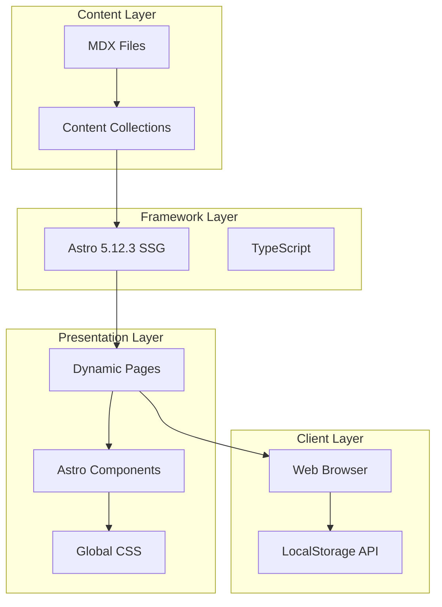

# 60天Web开发课程网站优化技术设计文档

## 1. 系统架构概述

### 1.1 当前架构


### 1.2 优化策略
- **渐进式增强**: 保持现有架构，通过CSS和客户端脚本增强功能
- **组件化改造**: 将重复功能抽象为可复用组件
- **样式分离**: 创建专门的样式模块，避免全局样式污染
- **状态管理**: 使用LocalStorage实现持久化状态

## 2. 详细设计方案

### 2.1 排版优化设计

#### 2.1.1 CSS变量更新
```css
/* 在 global.css 中新增/更新以下变量 */
:root {
  /* 排版相关变量 */
  --content-line-height: 1.9;
  --content-paragraph-spacing: 1.75rem;
  --content-max-width: 75ch;
  --content-mobile-padding: 1rem;
  --content-desktop-padding: 2rem;
  
  /* 标题间距 */
  --heading-margin-top: 2.5rem;
  --heading-margin-bottom: 1rem;
  --h1-margin-top: 3rem;
  --h2-margin-top: 2.5rem;
  --h3-margin-top: 2rem;
}
```

#### 2.1.2 内容样式优化
```css
/* 课程内容排版优化 */
.course-content {
  max-width: var(--content-max-width);
  margin: 0 auto;
  padding: 0 var(--content-desktop-padding);
}

.course-content p {
  line-height: var(--content-line-height);
  margin-bottom: var(--content-paragraph-spacing);
  text-align: justify;
  hyphens: auto;
}

.course-content h1,
.course-content h2,
.course-content h3 {
  line-height: 1.3;
  font-weight: 600;
  letter-spacing: -0.02em;
}

/* 响应式调整 */
@media (max-width: 768px) {
  .course-content {
    padding: 0 var(--content-mobile-padding);
  }
  
  .course-content p {
    text-align: left;
    hyphens: none;
  }
}
```

### 2.2 代码块样式优化

#### 2.2.1 增强代码块组件
```astro
---
// components/CodeBlock.astro
export interface Props {
  code: string;
  language: string;
  filename?: string;
  highlight?: number[];
  showLineNumbers?: boolean;
}

const { code, language, filename, highlight = [], showLineNumbers = true } = Astro.props;
const lines = code.split('\n');
const shouldShowNumbers = showLineNumbers && lines.length > 5;
---

<div class="code-block-wrapper">
  {filename && (
    <div class="code-block-header">
      <span class="code-filename">{filename}</span>
      <button class="copy-button" data-code={code}>
        <svg><!-- 复制图标 --></svg>
        <span>复制</span>
      </button>
    </div>
  )}
  
  <div class="code-block-container">
    {shouldShowNumbers && (
      <div class="line-numbers">
        {lines.map((_, i) => (
          <span class={highlight.includes(i + 1) ? 'highlighted' : ''}>
            {i + 1}
          </span>
        ))}
      </div>
    )}
    
    <pre class={`language-${language}`}>
      <code>{code}</code>
    </pre>
  </div>
</div>

<style>
  .code-block-wrapper {
    margin: var(--space-6) 0;
    border-radius: var(--radius-lg);
    overflow: hidden;
    background: var(--code-bg);
    box-shadow: var(--shadow-md);
  }
  
  .code-block-header {
    display: flex;
    justify-content: space-between;
    align-items: center;
    padding: var(--space-3) var(--space-4);
    background: var(--code-header-bg);
    border-bottom: 1px solid var(--border-color);
  }
  
  .code-block-container {
    display: flex;
    overflow-x: auto;
  }
  
  .line-numbers {
    display: flex;
    flex-direction: column;
    padding: var(--space-4);
    background: var(--code-gutter-bg);
    color: var(--code-gutter-color);
    user-select: none;
    font-family: var(--font-mono);
    font-size: var(--text-sm);
    line-height: 1.5;
  }
  
  pre {
    flex: 1;
    margin: 0;
    padding: var(--space-4) var(--space-6);
    overflow-x: auto;
  }
  
  /* 滚动条样式 */
  .code-block-container::-webkit-scrollbar {
    height: 8px;
  }
  
  .code-block-container::-webkit-scrollbar-track {
    background: var(--code-scrollbar-track);
  }
  
  .code-block-container::-webkit-scrollbar-thumb {
    background: var(--code-scrollbar-thumb);
    border-radius: 4px;
  }
</style>

<script>
  // 复制功能
  document.querySelectorAll('.copy-button').forEach(button => {
    button.addEventListener('click', async () => {
      const code = button.getAttribute('data-code');
      await navigator.clipboard.writeText(code);
      
      const span = button.querySelector('span');
      span.textContent = '已复制';
      
      setTimeout(() => {
        span.textContent = '复制';
      }, 2000);
    });
  });
</script>
```

### 2.3 交互式检查清单设计

#### 2.3.1 检查清单组件
```astro
---
// components/InteractiveChecklist.astro
export interface Props {
  day: number;
  items: string[];
}

const { day, items } = Astro.props;
const checklistId = `checklist-day-${day}`;
---

<div class="interactive-checklist" data-day={day}>
  <div class="checklist-header">
    <h2>✅ 今日检查清单</h2>
    <div class="checklist-progress">
      <span class="progress-text">0 / {items.length}</span>
      <div class="progress-bar">
        <div class="progress-fill"></div>
      </div>
    </div>
  </div>
  
  <div class="checklist-content">
    <p>确保你已完成以下任务：</p>
    <ul class="checklist-items">
      {items.map((item, index) => (
        <li>
          <label class="checklist-item">
            <input 
              type="checkbox" 
              data-index={index}
              data-checklist={checklistId}
            />
            <span class="checkbox-custom"></span>
            <span class="item-text">{item}</span>
          </label>
        </li>
      ))}
    </ul>
  </div>
  
  <div class="checklist-celebration hidden">
    <div class="celebration-icon">🎉</div>
    <p>太棒了！你已完成今日所有任务！</p>
  </div>
</div>

<style>
  .interactive-checklist {
    background: var(--bg-secondary);
    border-radius: var(--radius-lg);
    padding: var(--space-6);
    margin: var(--space-8) 0;
  }
  
  .checklist-header {
    display: flex;
    justify-content: space-between;
    align-items: center;
    margin-bottom: var(--space-4);
  }
  
  .checklist-progress {
    display: flex;
    align-items: center;
    gap: var(--space-3);
  }
  
  .progress-bar {
    width: 120px;
    height: 8px;
    background: var(--color-gray-300);
    border-radius: 4px;
    overflow: hidden;
  }
  
  .progress-fill {
    height: 100%;
    background: var(--color-success);
    width: 0;
    transition: width 0.3s ease;
  }
  
  .checklist-items {
    list-style: none;
    padding: 0;
    margin: var(--space-4) 0;
  }
  
  .checklist-item {
    display: flex;
    align-items: center;
    padding: var(--space-3) 0;
    cursor: pointer;
    transition: opacity 0.2s;
  }
  
  .checklist-item:hover {
    opacity: 0.8;
  }
  
  .checklist-item input[type="checkbox"] {
    position: absolute;
    opacity: 0;
  }
  
  .checkbox-custom {
    width: 24px;
    height: 24px;
    border: 2px solid var(--color-gray-400);
    border-radius: 4px;
    margin-right: var(--space-3);
    position: relative;
    transition: all 0.2s;
  }
  
  .checklist-item input:checked ~ .checkbox-custom {
    background: var(--color-success);
    border-color: var(--color-success);
  }
  
  .checklist-item input:checked ~ .checkbox-custom::after {
    content: '';
    position: absolute;
    left: 8px;
    top: 4px;
    width: 6px;
    height: 12px;
    border: solid white;
    border-width: 0 2px 2px 0;
    transform: rotate(45deg);
  }
  
  .checklist-item input:checked ~ .item-text {
    text-decoration: line-through;
    opacity: 0.7;
  }
  
  .checklist-celebration {
    text-align: center;
    padding: var(--space-6);
    animation: fadeIn 0.5s ease;
  }
  
  .celebration-icon {
    font-size: 3rem;
    margin-bottom: var(--space-3);
    animation: bounce 0.5s ease;
  }
  
  @keyframes fadeIn {
    from { opacity: 0; transform: translateY(10px); }
    to { opacity: 1; transform: translateY(0); }
  }
  
  @keyframes bounce {
    0%, 100% { transform: scale(1); }
    50% { transform: scale(1.2); }
  }
</style>

<script>
  class ChecklistManager {
    constructor() {
      this.initializeChecklists();
    }
    
    initializeChecklists() {
      document.querySelectorAll('.interactive-checklist').forEach(checklist => {
        const day = checklist.dataset.day;
        const checkboxes = checklist.querySelectorAll('input[type="checkbox"]');
        const progressText = checklist.querySelector('.progress-text');
        const progressFill = checklist.querySelector('.progress-fill');
        const celebration = checklist.querySelector('.checklist-celebration');
        
        // 恢复状态
        this.restoreState(day, checkboxes);
        
        // 更新进度
        this.updateProgress(checklist);
        
        // 添加事件监听
        checkboxes.forEach(checkbox => {
          checkbox.addEventListener('change', () => {
            this.saveState(day, checkboxes);
            this.updateProgress(checklist);
          });
        });
      });
    }
    
    restoreState(day, checkboxes) {
      const storageKey = `checklist-day-${day}`;
      const savedState = localStorage.getItem(storageKey);
      
      if (savedState) {
        const checkedItems = JSON.parse(savedState);
        checkboxes.forEach((checkbox, index) => {
          checkbox.checked = checkedItems.includes(index);
        });
      }
    }
    
    saveState(day, checkboxes) {
      const storageKey = `checklist-day-${day}`;
      const checkedItems = [];
      
      checkboxes.forEach((checkbox, index) => {
        if (checkbox.checked) {
          checkedItems.push(index);
        }
      });
      
      localStorage.setItem(storageKey, JSON.stringify(checkedItems));
    }
    
    updateProgress(checklist) {
      const checkboxes = checklist.querySelectorAll('input[type="checkbox"]');
      const checked = checklist.querySelectorAll('input[type="checkbox"]:checked');
      const progressText = checklist.querySelector('.progress-text');
      const progressFill = checklist.querySelector('.progress-fill');
      const celebration = checklist.querySelector('.checklist-celebration');
      
      const total = checkboxes.length;
      const completed = checked.length;
      const percentage = (completed / total) * 100;
      
      progressText.textContent = `${completed} / ${total}`;
      progressFill.style.width = `${percentage}%`;
      
      if (completed === total && total > 0) {
        celebration.classList.remove('hidden');
      } else {
        celebration.classList.add('hidden');
      }
    }
  }
  
  // 初始化
  document.addEventListener('DOMContentLoaded', () => {
    new ChecklistManager();
  });
</script>
```

### 2.4 练习页面布局优化

#### 2.4.1 改进的练习页面模板
```astro
---
// 更新 pages/course/day-[day]/exercise.astro
import BaseLayout from '@layouts/BaseLayout.astro';
import ExerciseRequirements from '@components/ExerciseRequirements.astro';
import ExerciseHints from '@components/ExerciseHints.astro';
import ExerciseResources from '@components/ExerciseResources.astro';
---

<BaseLayout title={pageTitle} description={pageDescription}>
  <div class="exercise-container">
    <!-- 面包屑导航 -->
    <nav class="breadcrumb" aria-label="面包屑导航">
      <!-- ... existing breadcrumb ... -->
    </nav>

    <!-- 练习主体 -->
    <article class="exercise-content">
      <!-- 练习头部 -->
      <header class="exercise-header">
        <div class="exercise-badges">
          <span class="phase-badge">{phase.data.name}</span>
          <span class="difficulty-badge difficulty-{exercise.data.difficulty}">
            {getDifficultyText(exercise.data.difficulty)}
          </span>
          <span class="time-badge">
            <svg><!-- 时钟图标 --></svg>
            {exercise.data.estimatedTime}分钟
          </span>
        </div>
        
        <h1 class="exercise-title">
          <span class="exercise-day">Day {day}</span>
          <span class="exercise-name">{exercise.data.title}</span>
        </h1>
        
        <p class="exercise-description">{exercise.data.description}</p>
      </header>

      <!-- 练习要求 -->
      <ExerciseRequirements requirements={exercise.data.requirements} />

      <!-- 练习提示 -->
      {exercise.data.hints && (
        <ExerciseHints hints={exercise.data.hints} />
      )}

      <!-- 起始代码 -->
      {exercise.data.starterCode && (
        <section class="starter-code-section">
          <h2>🚀 起始代码</h2>
          <CodeBlock 
            code={exercise.data.starterCode}
            language={exercise.data.language}
            filename="starter.js"
          />
        </section>
      )}

      <!-- 检查点 -->
      {exercise.data.checkpoints && (
        <section class="checkpoints-section">
          <h2>✔️ 完成检查点</h2>
          <InteractiveChecklist 
            day={day}
            items={exercise.data.checkpoints}
          />
        </section>
      )}

      <!-- 相关资源 -->
      {exercise.data.resources && (
        <ExerciseResources resources={exercise.data.resources} />
      )}

      <!-- 操作按钮 -->
      <div class="exercise-actions">
        <a href={`/course/day-${day}`} class="btn btn-outline">
          ← 返回课程
        </a>
        <a href={`/course/day-${day}/solution`} class="btn btn-primary">
          查看解决方案 →
        </a>
      </div>
    </article>

    <!-- 侧边栏 -->
    <aside class="exercise-sidebar">
      <div class="sidebar-card">
        <h3>💡 练习提示</h3>
        <ul>
          <li>仔细阅读所有要求</li>
          <li>先思考解决方案再编码</li>
          <li>遇到困难时查看提示</li>
          <li>完成后对比参考答案</li>
        </ul>
      </div>
      
      <div class="sidebar-card">
        <h3>📊 进度追踪</h3>
        <div class="progress-info">
          <p>当前阶段：{phase.data.name}</p>
          <p>第 {day} 天 / 共 60 天</p>
        </div>
      </div>
    </aside>
  </div>
</BaseLayout>

<style>
  .exercise-container {
    display: grid;
    grid-template-columns: 1fr 300px;
    gap: var(--space-8);
    max-width: var(--container-max-width);
    margin: 0 auto;
    padding: var(--space-6);
  }
  
  .exercise-content {
    background: var(--bg-primary);
    border-radius: var(--radius-lg);
    padding: var(--space-8);
    box-shadow: var(--shadow-base);
  }
  
  .exercise-header {
    margin-bottom: var(--space-8);
    padding-bottom: var(--space-6);
    border-bottom: 2px solid var(--border-color);
  }
  
  .exercise-badges {
    display: flex;
    gap: var(--space-3);
    margin-bottom: var(--space-4);
  }
  
  .exercise-title {
    display: flex;
    flex-direction: column;
    gap: var(--space-2);
    margin-bottom: var(--space-4);
  }
  
  .exercise-day {
    font-size: var(--text-lg);
    color: var(--color-primary);
    font-weight: 500;
  }
  
  .exercise-name {
    font-size: var(--text-3xl);
    font-weight: 700;
    line-height: 1.2;
  }
  
  .exercise-sidebar {
    display: flex;
    flex-direction: column;
    gap: var(--space-6);
  }
  
  .sidebar-card {
    background: var(--bg-secondary);
    padding: var(--space-6);
    border-radius: var(--radius-lg);
    box-shadow: var(--shadow-sm);
  }
  
  /* 响应式设计 */
  @media (max-width: 1024px) {
    .exercise-container {
      grid-template-columns: 1fr;
    }
    
    .exercise-sidebar {
      order: -1;
      flex-direction: row;
      gap: var(--space-4);
    }
    
    .sidebar-card {
      flex: 1;
    }
  }
  
  @media (max-width: 768px) {
    .exercise-container {
      padding: var(--space-4);
    }
    
    .exercise-content {
      padding: var(--space-4);
    }
    
    .exercise-sidebar {
      flex-direction: column;
    }
  }
</style>
```

### 2.5 文件查看功能设计

#### 2.5.1 文件查看模态框组件
```astro
---
// components/FileViewer.astro
export interface Props {
  fileId: string;
  filename: string;
  content: string;
  language: string;
}

const { fileId, filename, content, language } = Astro.props;
const lines = content.split('\n').length;
const fileSize = new Blob([content]).size;
---

<div class="file-viewer-modal" id={`file-viewer-${fileId}`}>
  <div class="modal-overlay"></div>
  <div class="modal-content">
    <header class="modal-header">
      <div class="file-info">
        <h3>{filename}</h3>
        <div class="file-meta">
          <span>{language.toUpperCase()}</span>
          <span>{lines} 行</span>
          <span>{(fileSize / 1024).toFixed(1)} KB</span>
        </div>
      </div>
      <div class="modal-actions">
        <button class="btn-icon download-btn" title="下载文件">
          <svg><!-- 下载图标 --></svg>
        </button>
        <button class="btn-icon copy-btn" title="复制全部">
          <svg><!-- 复制图标 --></svg>
        </button>
        <button class="btn-icon close-btn" title="关闭">
          <svg><!-- 关闭图标 --></svg>
        </button>
      </div>
    </header>
    
    <div class="modal-body">
      <CodeBlock 
        code={content}
        language={language}
        showLineNumbers={true}
      />
    </div>
  </div>
</div>

<style>
  .file-viewer-modal {
    display: none;
    position: fixed;
    inset: 0;
    z-index: 1000;
  }
  
  .file-viewer-modal.active {
    display: flex;
    align-items: center;
    justify-content: center;
  }
  
  .modal-overlay {
    position: absolute;
    inset: 0;
    background: rgba(0, 0, 0, 0.5);
    backdrop-filter: blur(4px);
  }
  
  .modal-content {
    position: relative;
    width: 90%;
    max-width: 1200px;
    max-height: 90vh;
    background: var(--bg-primary);
    border-radius: var(--radius-xl);
    box-shadow: var(--shadow-xl);
    display: flex;
    flex-direction: column;
  }
  
  .modal-header {
    display: flex;
    justify-content: space-between;
    align-items: center;
    padding: var(--space-6);
    border-bottom: 1px solid var(--border-color);
  }
  
  .file-info h3 {
    margin: 0;
    font-size: var(--text-xl);
  }
  
  .file-meta {
    display: flex;
    gap: var(--space-4);
    margin-top: var(--space-2);
    font-size: var(--text-sm);
    color: var(--text-secondary);
  }
  
  .modal-actions {
    display: flex;
    gap: var(--space-2);
  }
  
  .btn-icon {
    width: 40px;
    height: 40px;
    border-radius: var(--radius-md);
    border: none;
    background: var(--bg-secondary);
    color: var(--text-primary);
    cursor: pointer;
    display: flex;
    align-items: center;
    justify-content: center;
    transition: all 0.2s;
  }
  
  .btn-icon:hover {
    background: var(--bg-tertiary);
  }
  
  .modal-body {
    flex: 1;
    overflow: auto;
    padding: var(--space-6);
  }
</style>

<script>
  class FileViewerManager {
    constructor() {
      this.initializeViewers();
    }
    
    initializeViewers() {
      // 关闭按钮
      document.querySelectorAll('.file-viewer-modal .close-btn').forEach(btn => {
        btn.addEventListener('click', (e) => {
          const modal = e.target.closest('.file-viewer-modal');
          this.closeModal(modal);
        });
      });
      
      // 点击遮罩关闭
      document.querySelectorAll('.modal-overlay').forEach(overlay => {
        overlay.addEventListener('click', (e) => {
          const modal = e.target.closest('.file-viewer-modal');
          this.closeModal(modal);
        });
      });
      
      // 下载功能
      document.querySelectorAll('.download-btn').forEach(btn => {
        btn.addEventListener('click', (e) => {
          const modal = e.target.closest('.file-viewer-modal');
          const filename = modal.querySelector('.file-info h3').textContent;
          const content = modal.querySelector('pre code').textContent;
          this.downloadFile(filename, content);
        });
      });
      
      // 复制功能
      document.querySelectorAll('.modal-actions .copy-btn').forEach(btn => {
        btn.addEventListener('click', async (e) => {
          const modal = e.target.closest('.file-viewer-modal');
          const content = modal.querySelector('pre code').textContent;
          await navigator.clipboard.writeText(content);
          
          // 显示反馈
          const originalTitle = btn.title;
          btn.title = '已复制！';
          setTimeout(() => {
            btn.title = originalTitle;
          }, 2000);
        });
      });
    }
    
    openModal(modalId) {
      const modal = document.getElementById(modalId);
      if (modal) {
        modal.classList.add('active');
        document.body.style.overflow = 'hidden';
      }
    }
    
    closeModal(modal) {
      modal.classList.remove('active');
      document.body.style.overflow = '';
    }
    
    downloadFile(filename, content) {
      const blob = new Blob([content], { type: 'text/plain' });
      const url = URL.createObjectURL(blob);
      const a = document.createElement('a');
      a.href = url;
      a.download = filename;
      a.click();
      URL.revokeObjectURL(url);
    }
  }
  
  // 初始化
  const fileViewerManager = new FileViewerManager();
  
  // 暴露全局方法供外部调用
  window.openFileViewer = (modalId) => {
    fileViewerManager.openModal(modalId);
  };
</script>
```

### 2.6 代码展示优化设计

#### 2.6.1 智能代码展示组件
```astro
---
// components/SmartCodeDisplay.astro
export interface Props {
  files: Array<{
    filename: string;
    language: string;
    content: string;
    keySection?: {
      start: number;
      end: number;
      description: string;
    }[];
  }>;
  day: number;
}

const { files, day } = Astro.props;

// 处理代码内容，提取关键部分
function processCode(content: string, keySections?: any[]) {
  const lines = content.split('\n');
  const processedSections = [];
  
  if (keySections && keySections.length > 0) {
    keySections.forEach(section => {
      processedSections.push({
        ...section,
        content: lines.slice(section.start - 1, section.end).join('\n')
      });
    });
  } else {
    // 自动检测关键部分（通过注释标记）
    const importantMarkers = ['KEY:', 'IMPORTANT:', '重要:', '关键:'];
    let currentSection = null;
    
    lines.forEach((line, index) => {
      if (importantMarkers.some(marker => line.includes(marker))) {
        if (currentSection) {
          processedSections.push(currentSection);
        }
        currentSection = {
          start: index + 1,
          end: index + 1,
          description: line.trim(),
          content: ''
        };
      } else if (currentSection && line.trim() && !line.trim().startsWith('//')) {
        currentSection.end = index + 1;
        currentSection.content += line + '\n';
      }
    });
    
    if (currentSection) {
      processedSections.push(currentSection);
    }
  }
  
  return {
    fullContent: content,
    sections: processedSections,
    totalLines: lines.length
  };
}
---

<div class="smart-code-display">
  {files.map((file, fileIndex) => {
    const processed = processCode(file.content, file.keySection);
    const fileId = `file-${day}-${fileIndex}`;
    
    return (
      <div class="code-file-display">
        <header class="file-header">
          <div class="file-title">
            <h3>{file.filename}</h3>
            <span class="file-lang">{file.language}</span>
            <span class="file-lines">{processed.totalLines} 行</span>
          </div>
          <div class="file-actions">
            {processed.totalLines > 50 && (
              <button 
                class="view-full-btn"
                onclick={`openFileViewer('file-viewer-${fileId}')`}
              >
                查看完整文件
              </button>
            )}
          </div>
        </header>
        
        {processed.sections.length > 0 ? (
          <div class="code-sections">
            <div class="sections-intro">
              <p>以下是代码的关键部分：</p>
            </div>
            
            {processed.sections.map((section, sectionIndex) => (
              <div class="code-section">
                <div class="section-header">
                  <span class="section-label">
                    行 {section.start}-{section.end}
                  </span>
                  {section.description && (
                    <span class="section-description">
                      {section.description}
                    </span>
                  )}
                </div>
                <CodeBlock
                  code={section.content}
                  language={file.language}
                  highlight={[]}
                  showLineNumbers={true}
                />
              </div>
            ))}
            
            <details class="full-code-toggle">
              <summary>查看完整代码</summary>
              <div class="full-code-content">
                <CodeBlock
                  code={processed.fullContent}
                  language={file.language}
                  showLineNumbers={true}
                />
              </div>
            </details>
          </div>
        ) : (
          <div class="code-content">
            {processed.totalLines > 100 ? (
              <>
                <div class="code-preview">
                  <CodeBlock
                    code={processed.fullContent.split('\n').slice(0, 50).join('\n')}
                    language={file.language}
                    showLineNumbers={true}
                  />
                  <div class="fade-overlay">
                    <p>文件较长，仅显示前50行</p>
                  </div>
                </div>
                <button 
                  class="view-more-btn"
                  onclick={`openFileViewer('file-viewer-${fileId}')`}
                >
                  查看完整文件 ({processed.totalLines} 行)
                </button>
              </>
            ) : (
              <CodeBlock
                code={processed.fullContent}
                language={file.language}
                showLineNumbers={true}
              />
            )}
          </div>
        )}
        
        <!-- 文件查看器模态框 -->
        <FileViewer
          fileId={fileId}
          filename={file.filename}
          content={processed.fullContent}
          language={file.language}
        />
      </div>
    );
  })}
</div>

<style>
  .smart-code-display {
    display: flex;
    flex-direction: column;
    gap: var(--space-6);
  }
  
  .code-file-display {
    background: var(--bg-secondary);
    border-radius: var(--radius-lg);
    overflow: hidden;
    box-shadow: var(--shadow-base);
  }
  
  .file-header {
    display: flex;
    justify-content: space-between;
    align-items: center;
    padding: var(--space-4) var(--space-6);
    background: var(--bg-tertiary);
    border-bottom: 1px solid var(--border-color);
  }
  
  .file-title {
    display: flex;
    align-items: center;
    gap: var(--space-3);
  }
  
  .file-title h3 {
    margin: 0;
    font-size: var(--text-lg);
  }
  
  .file-lang,
  .file-lines {
    font-size: var(--text-sm);
    color: var(--text-secondary);
    padding: var(--space-1) var(--space-2);
    background: var(--bg-primary);
    border-radius: var(--radius-sm);
  }
  
  .code-sections {
    padding: var(--space-6);
  }
  
  .sections-intro {
    margin-bottom: var(--space-4);
    color: var(--text-secondary);
  }
  
  .code-section {
    margin-bottom: var(--space-6);
  }
  
  .section-header {
    display: flex;
    align-items: center;
    gap: var(--space-3);
    margin-bottom: var(--space-3);
  }
  
  .section-label {
    font-size: var(--text-sm);
    color: var(--color-primary);
    font-weight: 500;
  }
  
  .section-description {
    font-size: var(--text-sm);
    color: var(--text-secondary);
    font-style: italic;
  }
  
  .full-code-toggle {
    margin-top: var(--space-6);
    padding: var(--space-4);
    background: var(--bg-primary);
    border-radius: var(--radius-md);
    cursor: pointer;
  }
  
  .full-code-toggle summary {
    font-weight: 500;
    color: var(--color-primary);
    list-style: none;
    display: flex;
    align-items: center;
    gap: var(--space-2);
  }
  
  .full-code-toggle summary::before {
    content: '▶';
    transition: transform 0.2s;
  }
  
  .full-code-toggle[open] summary::before {
    transform: rotate(90deg);
  }
  
  .full-code-content {
    margin-top: var(--space-4);
  }
  
  .code-preview {
    position: relative;
  }
  
  .fade-overlay {
    position: absolute;
    bottom: 0;
    left: 0;
    right: 0;
    height: 100px;
    background: linear-gradient(transparent, var(--bg-secondary));
    display: flex;
    align-items: flex-end;
    justify-content: center;
    padding-bottom: var(--space-4);
  }
  
  .view-more-btn,
  .view-full-btn {
    background: var(--color-primary);
    color: white;
    border: none;
    padding: var(--space-2) var(--space-4);
    border-radius: var(--radius-md);
    cursor: pointer;
    font-size: var(--text-sm);
    transition: background 0.2s;
  }
  
  .view-more-btn:hover,
  .view-full-btn:hover {
    background: var(--color-primary-dark);
  }
  
  .view-more-btn {
    display: block;
    margin: var(--space-4) auto;
  }
</style>
```

## 3. 实施计划

### 3.1 第一阶段：样式优化（2天）
1. 更新 global.css 添加新的CSS变量
2. 优化排版相关样式
3. 改进代码块样式
4. 测试响应式效果

### 3.2 第二阶段：组件开发（3天）
1. 开发 CodeBlock 组件
2. 开发 InteractiveChecklist 组件
3. 开发 FileViewer 组件
4. 开发 SmartCodeDisplay 组件

### 3.3 第三阶段：页面改造（3天）
1. 更新课程页面模板
2. 改造练习页面布局
3. 优化解决方案页面
4. 集成新组件

### 3.4 第四阶段：内容迁移（2天）
1. 处理MDX内容中的检查清单
2. 更新代码示例展示方式
3. 添加文件元数据

### 3.5 第五阶段：测试优化（2天）
1. 跨浏览器测试
2. 性能优化
3. 用户反馈收集
4. 最终调整

## 4. 技术考虑

### 4.1 性能优化
- 使用CSS contain属性优化渲染
- 实现代码高亮的懒加载
- 优化LocalStorage读写

### 4.2 可访问性
- 确保键盘导航支持
- 添加适当的ARIA标签
- 保持足够的颜色对比度

### 4.3 可维护性
- 组件化设计，便于复用
- 清晰的代码注释
- 完善的错误处理

## 5. 风险与缓解

### 5.1 内容兼容性风险
- **风险**: MDX内容格式可能不统一
- **缓解**: 创建内容处理脚本，统一格式

### 5.2 性能影响风险
- **风险**: 新功能可能影响页面加载速度
- **缓解**: 实施渐进式增强，关键功能优先

### 5.3 浏览器兼容性风险
- **风险**: 某些功能在老旧浏览器不支持
- **缓解**: 提供降级方案，确保基本功能可用