# Learning Experience Enhancement Technical Design

## Overview
This document provides the technical design for implementing the learning experience enhancements defined in the requirements document. The design is organized by implementation phases to support incremental delivery.

## Architecture Overview

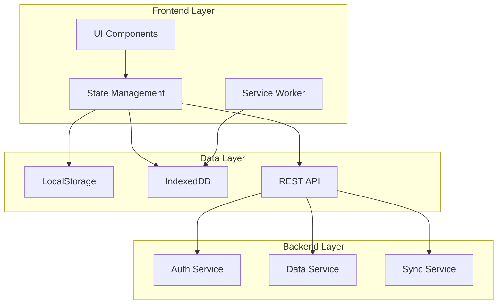

## Phase 1: Immediate Improvements (1-2 Days)

### 1.1 Enhanced Code Block Copy Functionality

#### Component Structure
```typescript
// src/components/CodeBlock.astro
interface Props {
  code: string;
  lang?: string;
  showLineNumbers?: boolean;
  filename?: string;
}

// src/components/CopyButton.astro
interface Props {
  text: string;
  className?: string;
}
```

#### Implementation Details
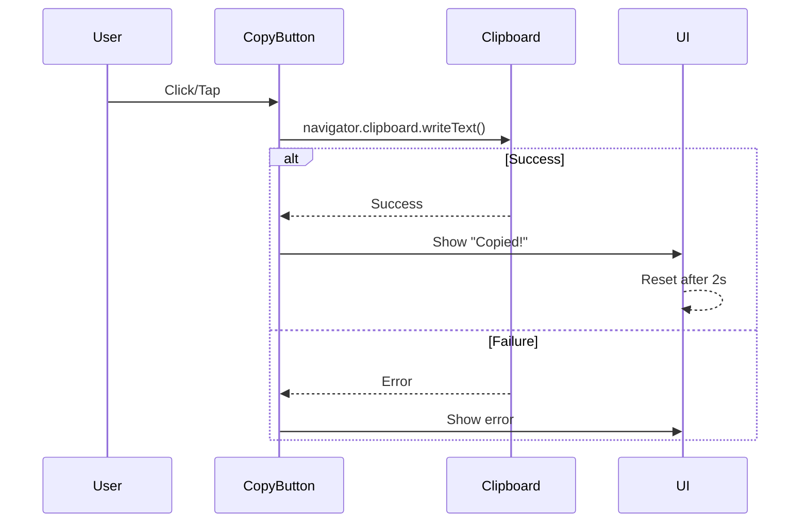

#### CSS Design System
```css
/* Code block enhancements */
:root {
  --code-block-bg: #1e1e1e;
  --code-block-border: #333;
  --copy-btn-bg: #2d2d2d;
  --copy-btn-hover: #3d3d3d;
  --copy-btn-success: #10b981;
  --line-number-color: #858585;
}

.code-block-wrapper {
  position: relative;
  margin: 1rem 0;
}

.copy-button {
  position: absolute;
  top: 0.5rem;
  right: 0.5rem;
  opacity: 0;
  transition: opacity 0.2s;
}

.code-block-wrapper:hover .copy-button,
.copy-button:focus,
.copy-button.always-visible {
  opacity: 1;
}

@media (max-width: 768px) {
  .copy-button {
    opacity: 1; /* Always visible on mobile */
  }
}
```

### 1.2 Mobile Code Block Scrolling

#### Component Enhancement
```typescript
// Enhanced code block with scroll indicators
interface CodeBlockProps {
  code: string;
  lang?: string;
  maxHeight?: string;
  showScrollIndicators?: boolean;
}
```

#### Scroll Indicator Implementation
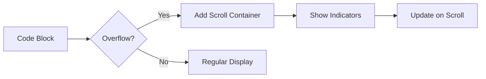

### 1.3 Code Block Line Numbers

#### Line Number Rendering
```typescript
// src/lib/codeHighlight.ts
interface HighlightOptions {
  language: string;
  showLineNumbers: boolean;
  startLine?: number;
  highlightLines?: number[];
}

function renderCodeWithLineNumbers(
  code: string, 
  options: HighlightOptions
): string {
  // Implementation using Shiki with line number support
}
```

## Phase 2: Short-term Optimizations (1-2 Weeks)

### 2.1 Cross-Device Progress Synchronization

#### Data Model
```typescript
// src/types/progress.ts
interface UserProgress {
  userId: string;
  lastSyncedAt: Date;
  devices: DeviceInfo[];
  lessons: LessonProgress[];
}

interface LessonProgress {
  day: number;
  completedAt?: Date;
  timeSpent: number;
  notes?: string;
  exercises?: ExerciseProgress[];
}

interface SyncConflict {
  local: UserProgress;
  remote: UserProgress;
  resolution: 'local' | 'remote' | 'merge';
}
```

#### Sync Architecture
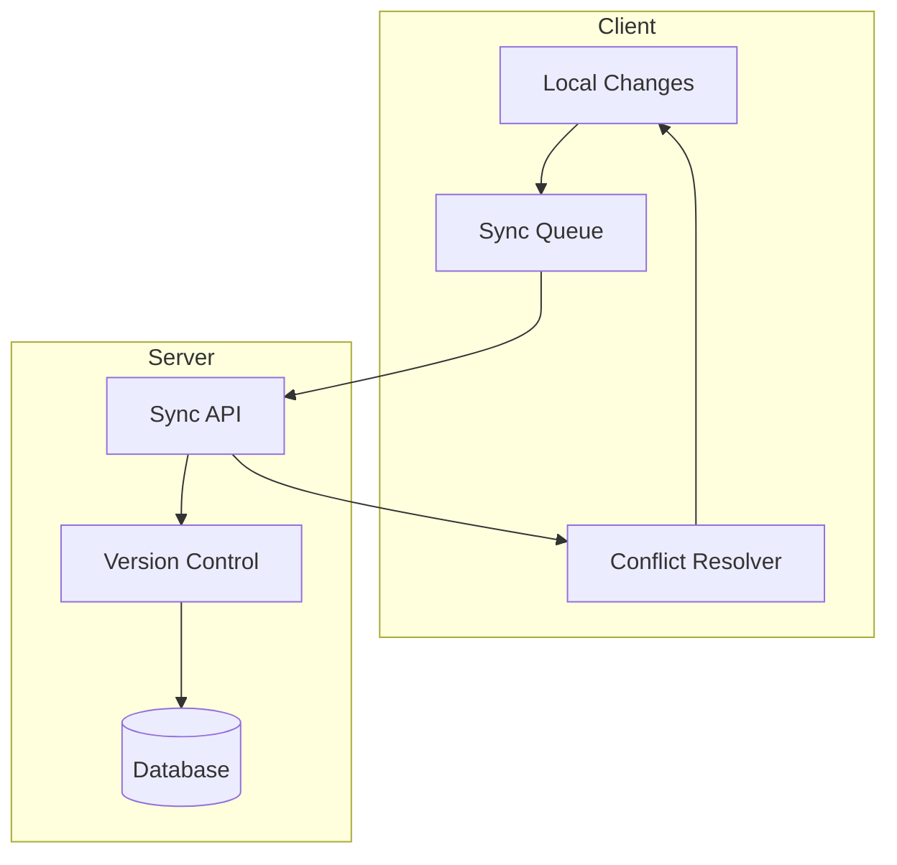

#### Sync Service Implementation
```typescript
// src/lib/syncService.ts
class SyncService {
  private syncQueue: SyncItem[] = [];
  private syncInterval: number = 30000; // 30 seconds
  
  async syncProgress(): Promise<SyncResult> {
    // 1. Get local changes
    // 2. Send to server
    // 3. Handle conflicts
    // 4. Update local state
  }
  
  async resolveConflict(conflict: SyncConflict): Promise<UserProgress> {
    // Conflict resolution logic
  }
}
```

### 2.2 Basic Note-Taking Functionality

#### Note Storage Schema
```typescript
// IndexedDB schema for notes
interface NoteSchema {
  id: string;
  lessonDay: number;
  content: string;
  createdAt: Date;
  updatedAt: Date;
  tags?: string[];
  isPublic?: boolean;
}
```

#### Note Editor Component
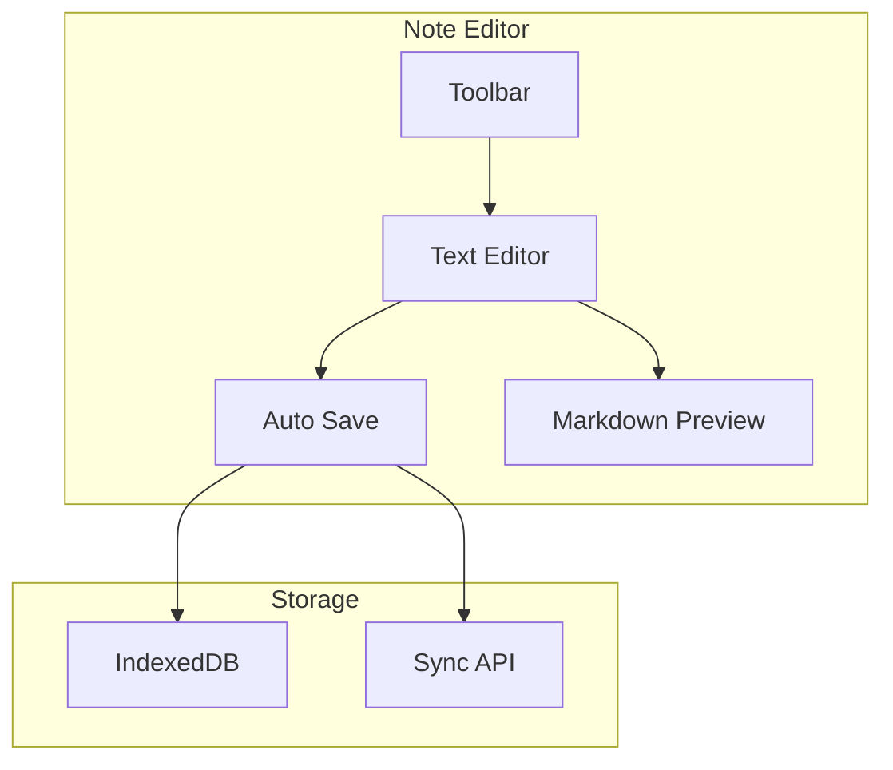

### 2.3 Enhanced Mobile Navigation

#### Navigation Components
```typescript
// src/components/MobileNavigation.astro
interface MobileNavProps {
  currentDay: number;
  currentPhase: number;
  totalDays: number;
}

// src/components/SwipeHandler.astro
interface SwipeHandlerProps {
  onSwipeLeft: () => void;
  onSwipeRight: () => void;
  threshold?: number;
}
```

#### Navigation State Machine
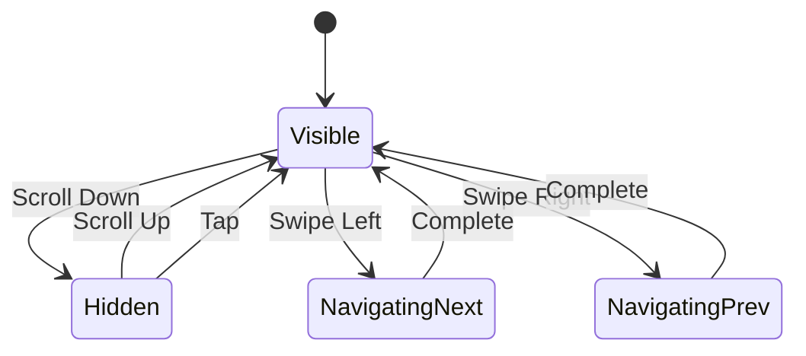

### 2.4 Interactive Code Examples

#### Sandbox Architecture
```typescript
// src/lib/codeSandbox.ts
interface SandboxConfig {
  runtime: 'javascript' | 'typescript' | 'react';
  dependencies?: Record<string, string>;
  timeout?: number;
}

class CodeSandbox {
  private worker: Worker;
  
  async execute(code: string, config: SandboxConfig): Promise<ExecutionResult> {
    // Sandbox execution logic
  }
}
```

#### Execution Flow
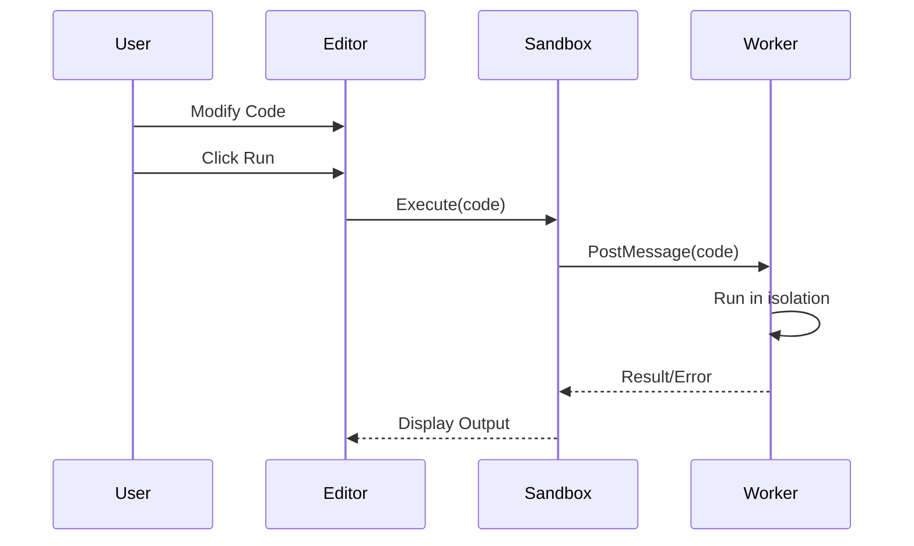

## Phase 3: Medium-to-Long-term Enhancements (1-2 Months)

### 3.1 Advanced Progress Analytics

#### Analytics Data Model
```typescript
interface LearningAnalytics {
  userId: string;
  metrics: {
    totalTimeSpent: number;
    averageSessionDuration: number;
    completionRate: number;
    streakDays: number;
    strongTopics: string[];
    weakTopics: string[];
  };
  timeline: TimelineEntry[];
  recommendations: Recommendation[];
}

interface TimelineEntry {
  date: Date;
  lessonsCompleted: number[];
  timeSpent: number;
  exercisesAttempted: number;
  successRate: number;
}
```

#### Analytics Dashboard Components
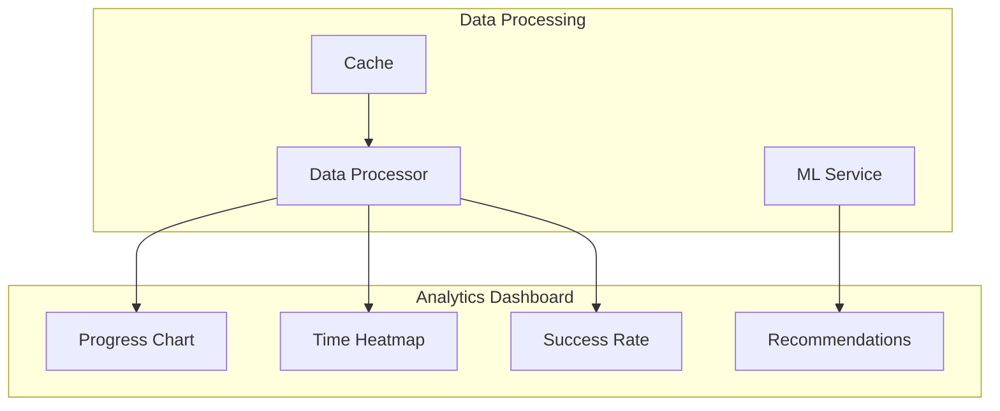

### 3.2 Collaborative Learning Features

#### Collaboration Schema
```typescript
interface Discussion {
  id: string;
  lessonDay: number;
  author: UserProfile;
  content: string;
  replies: Reply[];
  votes: number;
  tags: string[];
}

interface SharedNote {
  id: string;
  author: UserProfile;
  lessonDay: number;
  content: string;
  visibility: 'public' | 'friends' | 'private';
  collaborators?: string[];
}
```

#### Real-time Collaboration
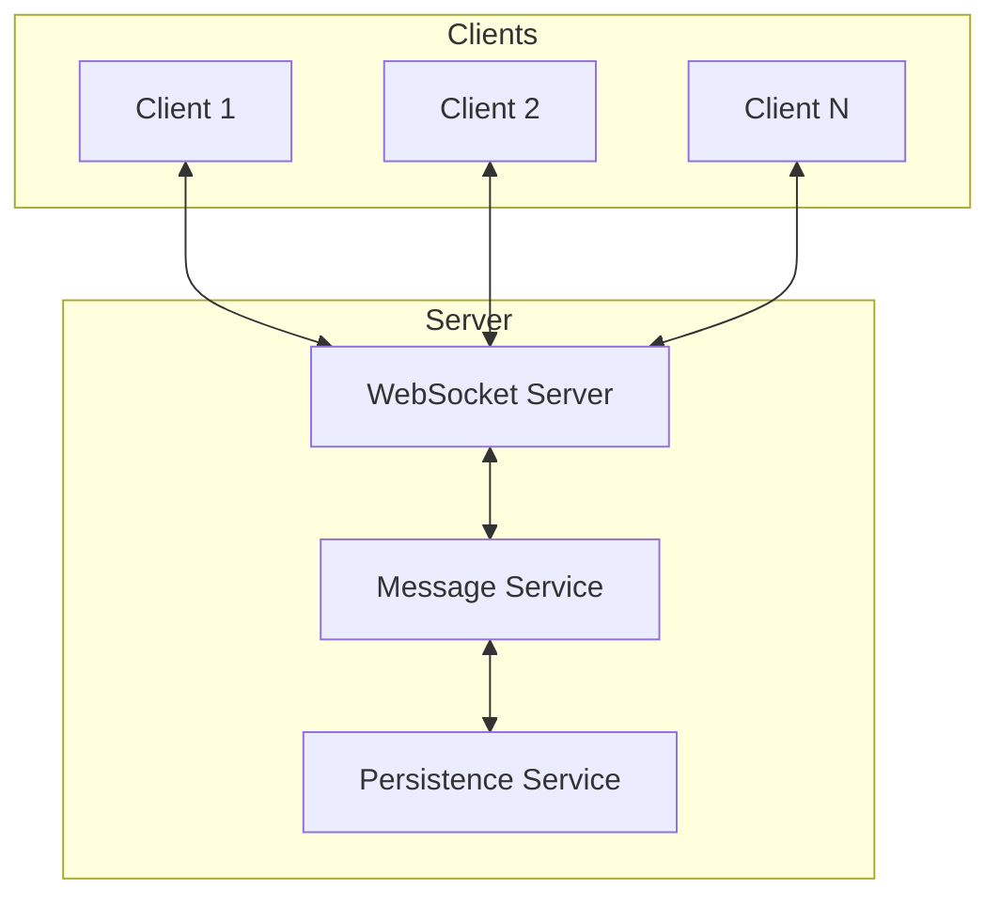

### 3.3 Offline Learning Support

#### Service Worker Strategy
```typescript
// src/sw.ts
const CACHE_NAME = 'course-offline-v1';
const CONTENT_CACHE = 'course-content-v1';
const DYNAMIC_CACHE = 'course-dynamic-v1';

interface CacheStrategy {
  networkFirst: string[];
  cacheFirst: string[];
  networkOnly: string[];
}

// Progressive enhancement for offline
class OfflineManager {
  async downloadLesson(day: number): Promise<void> {
    // Download and cache lesson content
  }
  
  async getAvailableOffline(): Promise<number[]> {
    // Return list of available offline lessons
  }
}
```

#### Offline Sync Queue
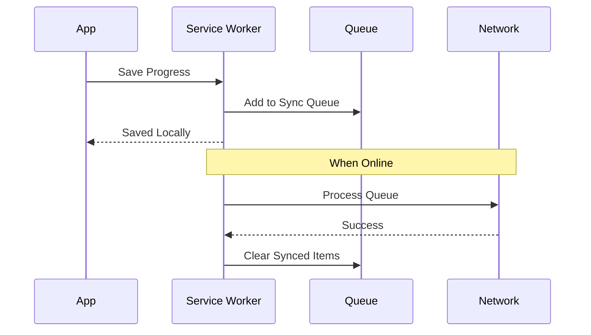

### 3.4 Personalized Learning Paths

#### Personalization Engine
```typescript
interface LearningProfile {
  userId: string;
  skillLevel: SkillAssessment;
  learningStyle: 'visual' | 'practical' | 'theoretical';
  goals: string[];
  interests: string[];
  completedTopics: string[];
  strugglingTopics: string[];
}

interface PersonalizedPath {
  recommendedOrder: LessonRecommendation[];
  skipSuggestions: number[];
  additionalResources: Resource[];
  estimatedCompletionTime: number;
}

class PersonalizationEngine {
  async generatePath(profile: LearningProfile): Promise<PersonalizedPath> {
    // ML-based path generation
  }
}
```

#### Adaptive Learning Flow
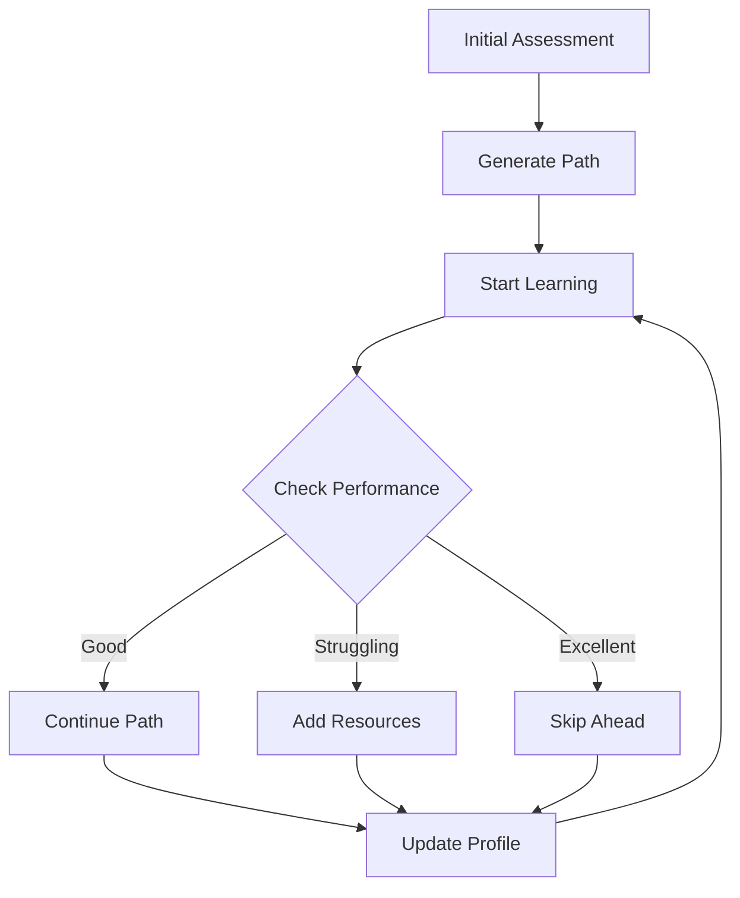

## Technical Considerations

### Performance Optimizations
1. **Code Splitting**: Dynamic imports for feature modules
2. **Lazy Loading**: Load interactive features on demand
3. **Caching Strategy**: Aggressive caching for static content
4. **Bundle Optimization**: Separate vendor and app bundles

### Security Measures
1. **Authentication**: JWT with refresh tokens
2. **Data Encryption**: AES-256 for sensitive data
3. **XSS Prevention**: Content Security Policy headers
4. **Rate Limiting**: API throttling per user

### Monitoring & Analytics
1. **Error Tracking**: Sentry integration
2. **Performance Monitoring**: Web Vitals tracking
3. **User Analytics**: Privacy-focused analytics
4. **A/B Testing**: Feature flag system

### Testing Strategy
1. **Unit Tests**: Component and utility testing
2. **Integration Tests**: API and service testing
3. **E2E Tests**: Critical user flows
4. **Performance Tests**: Load and stress testing